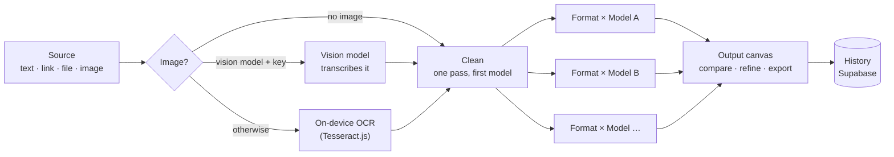
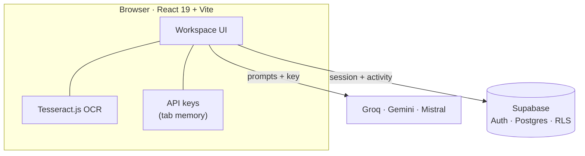

<div align="center">

# Sankshep.ai

**One source in. Every format out.**

A generative AI workspace that turns a single report, article or advisory into executive summaries, social posts, slide outlines, video scripts and translations, all drafted in parallel.

*Smart India Hackathon 2026 · Problem statement: Gen AI Platform for Automated Content Transformation*

[](https://react.dev)
[](https://www.typescriptlang.org)
[](https://vite.dev)
[](https://tailwindcss.com)
[](https://supabase.com)

[What it does](#what-it-does) · [How it works](#how-it-works) · [Quick start](#quick-start) · [Architecture](#architecture) · [Team](#team)

</div>

---

## What it does

Organisations spend hours turning the same source material into briefs, posts, decks and scripts. Sankshep (संक्षेप, Hindi for *"in brief"*) does that step for them:

1. **Bring a source.** Paste text, drop a link, upload a TXT, Markdown, CSV or JSON file, or upload an image.
2. **Choose what you need.** Pick any of 10 formats, or describe your own; set the tone, the target audience and the AI model.
3. **Get every draft at once.** Each format is written in parallel. Compare models side by side, refine any single draft in plain language, and find it all again in your History.

## Features

| | |
|---|---|
| **10 output formats + custom** | Executive Summary, LinkedIn Post, Twitter/X thread, Video script and storyboard, Slide deck outline, Blog Post, Advisory, Infographic brief, Simplified Explanation, and translation into six Indian languages. Or describe a format in your own words. |
| **Bring your own key** | Choose from **Groq**, **Google Gemini** or **Mistral** models and paste your own API key. Keys stay in the browser tab's memory and are sent only to that provider. Groq falls back to the workspace key when left empty. |
| **Model comparison** | Run the same brief through up to **3 models** and read the drafts side by side, each with word counts and one-click copy. |
| **Image ingestion** | Images are read by a vision model (Gemini, Pixtral, Mistral Medium/Small) when you have one selected, or by **on-device OCR** (Tesseract.js) that never uploads the image. |
| **Audience targeting** | Presets for executives, HR/sales, technical teams and the general public, or a custom audience profile you describe. |
| **Refine one draft** | Ask for "shorter", "add a risk table" or anything else; only that draft is rewritten, by the same model. |
| **History & Analytics** | Every draft is logged with its format, provider, model and word counts. Filter your history by format and see usage at a glance. |
| **Accounts & admin** | Email sign-up with no verification step, a shared demo account, self-service account deletion, and an admin panel for all users and activity. |

## How it works

The pipeline in [`src/lib/pipeline.ts`](main/src/lib/pipeline.ts) is shaped like a LangGraph state graph:



- **Ingest:** images become text first, so every model, including text-only ones, can work from them.
- **Clean:** one call to the first selected model strips noise and repairs formatting. If it fails, the run continues with the raw text.
- **Draft in parallel:** every *(format, model)* pair is its own node, run together with `Promise.allSettled`, so one failed draft never takes down the rest. Tone and audience go into every prompt.
- **Review:** drafts land on the canvas; each model's run is logged as its own History entry.

### What goes where

| | Your browser | AI provider you pick | Sankshep database |
|---|---|---|---|
| **Source text** | Read here first | Sent to write drafts | First 300 characters only |
| **API key** | Tab memory only | Sent with each request | **Never stored** |
| **Uploaded image** | OCR runs here | Only if you pick a vision model | **Never stored** |
| **Drafts** | Shown on the canvas | Written there | Kept for your History |
| **Password** | Typed here | **Never sent** | Salted hash (Supabase Auth) |

The full detail is on the in-app [Privacy Policy](main/src/pages/legal/PrivacyPolicyPage.tsx) page (`/privacy-policy`).

## Quick start

**Prerequisites:** Node.js 22 and at least one [Groq API key](https://console.groq.com/keys) (free).

```bash
cd main
npm install
cp .env.local.example .env.local   # then add your key, see below
npm run dev
```

Open <http://localhost:5173>, click **Use Demo Credentials** on the sign-in page, and you're in.

In `.env.local`:

```bash
VITE_GROQ_KEY_1=gsk_your_key_here
```

> **No Supabase setup needed.** Every copy of the app connects to the same central Supabase project, pinned in [`src/lib/supabase.ts`](main/src/lib/supabase.ts). Accounts and activity are shared across all machines.

### Environment variables

| Variable | Required | Purpose |
|---|---|---|
| `VITE_GROQ_KEY_1` | Yes* | The workspace's Groq key, used when a user leaves the Groq key field empty |
| `VITE_GROQ_KEY_2` … `_5` | No | Extra Groq keys, rotated per request to spread rate limits |

\* Without it, users can still generate by pasting their own Groq, Gemini or Mistral key in the **AI engine** step.

### Scripts

| Command | What it does |
|---|---|
| `npm run dev` | Dev server with hot reload |
| `npm run build` | Production build to `main/dist/` |
| `npm run preview` | Serve the production build locally |
| `npm run format` | Format with oxfmt |

## Architecture

There is no application server. The React app talks directly to Supabase (auth and data) and to the AI provider the user picks; all three providers allow browser requests.



### Tech stack

| Layer | Tools |
|---|---|
| Interface | React 19, TypeScript 5.7, Vite 8, Tailwind CSS v4, React Router 7, Motion (animations), Lucide icons |
| AI | Groq, Google Gemini API and Mistral via their REST APIs; Tesseract.js for on-device OCR |
| Data & auth | Supabase Auth and Postgres with row-level security |
| Hosting | Any static host; `vercel.json` is included for Vercel |

### Routes

| Route | Page | Access |
|---|---|---|
| `/` | Landing page | Public |
| `/how-it-works` | Animated walkthrough of the pipeline and data flow | Public |
| `/about` | The team and the SIH problem statement | Public |
| `/privacy-policy`, `/terms-and-conditions` | Legal pages | Public |
| `/login` | Sign in / sign up | Public |
| `/workspace` | Transform: configure and generate | Signed in |
| `/workspace/history` | Every draft, filterable by format | Signed in |
| `/workspace/analytics` | Totals, format usage, recent drafts | Signed in |
| `/workspace/admin` | All users and all activity | Admin only |

### Security model

- **Every `/workspace` path is behind an auth guard.** Nothing renders until the session check finishes; signed-out visitors are sent to `/login`.
- **The guard is only the first layer.** The database enforces access on its own: row-level security lets an account read only its own rows (or everyone's, for the admin), insert only as itself, and every admin and deletion function checks permissions on the server.
- **API keys are never persisted,** not to Supabase, logs or browser storage.

### Project structure

```
main/
├── src/
│   ├── lib/
│   │   ├── pipeline.ts          # Ingest → clean → parallel (format × model) drafts
│   │   ├── providers.ts         # Groq / Gemini / Mistral catalogue and chat client
│   │   ├── ingest.ts            # Image → text: vision model or on-device OCR
│   │   ├── groq.ts              # Workspace Groq keys with rotation
│   │   ├── activity.ts          # Activity logging and History/Analytics queries
│   │   └── supabase.ts          # Central Supabase client
│   ├── contexts/AuthContext.tsx # Session, sign-in/up, account deletion
│   ├── components/
│   │   ├── ProtectedRoute.tsx   # Auth guard for /workspace/*
│   │   └── site/SiteChrome.tsx  # Shared site nav and footer
│   ├── pages/
│   │   ├── LandingPage.tsx
│   │   ├── HowItWorksPage.tsx
│   │   ├── AboutPage.tsx
│   │   ├── LoginPage.tsx
│   │   ├── WorkspacePage.tsx    # Workspace shell and tabs
│   │   └── legal/               # Privacy Policy and Terms
│   ├── workspace/
│   │   ├── TransformView.tsx    # Runs the pipeline, logs each model's run
│   │   ├── LeftPanel.tsx        # Source, formats, voice, audience, engine
│   │   ├── RightPanel.tsx       # Output canvas, comparison, refine, export
│   │   ├── HistoryView.tsx
│   │   ├── AnalyticsView.tsx
│   │   └── AdminPanel.tsx
│   └── index.css                # Tailwind v4 theme and design tokens
├── supabase/
│   ├── schema.sql               # Tables, RLS, functions, demo account
│   └── create_admin.sql         # Creates or resets the admin account
└── vercel.json
```

## Database setup

*One-time, for the project owner only.*

1. In the Supabase dashboard, open **SQL Editor**, paste [`main/supabase/schema.sql`](main/supabase/schema.sql), and run it. This creates `profiles` and `activity_logs`, the row-level security policies, the admin and deletion functions, and the shared demo account `demo@sankshep.ai` / `demo123`. It is safe to run again; section 10 adds the per-draft word count and model columns used by History.
2. Under **Authentication → Sign In / Providers → Email**, turn **Confirm email** off and save. Accounts are created and signed in immediately, and no emails are sent.
3. To create the admin, paste [`main/supabase/create_admin.sql`](main/supabase/create_admin.sql) into the SQL Editor, replace `CHANGE_ME` with a password of 6+ characters, and run it. Re-run it any time to reset the password. `admin@gmail.com` gets the admin role automatically.

Users can delete their own account from the account menu in the workspace; the admin can delete any account from the Admin panel. The demo and admin accounts can't be deleted.

## Deploy

1. Import the repo in Vercel and set **Root Directory** to `main`. `vercel.json` handles the build and the single-page-app rewrites.
2. Add `VITE_GROQ_KEY_1` (and optionally `_2` … `_5`) under **Project → Settings → Environment Variables**. Supabase needs nothing.

## Known limitations

- **PDF and DOCX are not parsed yet.** They upload, but only their file name reaches the model. Paste their text instead.
- **Links are not fetched.** A pasted URL is passed to the model as a reference, not downloaded.
- **The demo account is shared.** Anyone using it can see its History, so don't put private material there.
- **AI drafts can include facts that aren't in the source.** Check them before use.

## Team

**Neural Ninjas VGEC**

Siddharth Devmurari · Vraj Patel · Suhani Jain · Darshil Dhanani · Harshit Vadher · Harsh Thakkar

---

<div align="center">
<sub>Built for Smart India Hackathon 2026 · <a href="main/src/pages/legal/TermsPage.tsx">Terms</a> · <a href="main/src/pages/legal/PrivacyPolicyPage.tsx">Privacy</a></sub>
</div>
