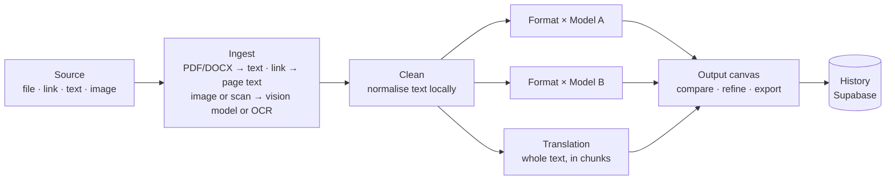
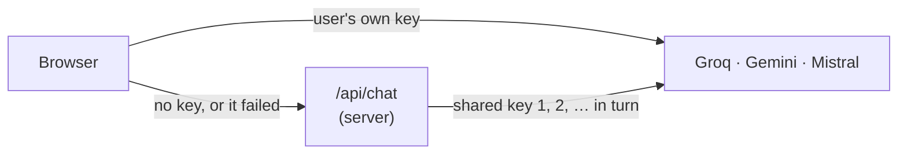
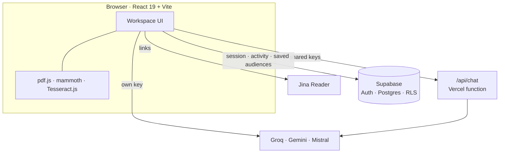

<div align="center">

# Sankshep.ai

**One source in. Every format out.**

A generative AI workspace that turns a single report, article or advisory into executive summaries, social posts, slide outlines, video scripts and translations, all drafted in parallel.

*Smart India Hackathon 2026 · Problem statement: Gen AI Platform for Automated Content Transformation*

[](https://react.dev)
[](https://www.typescriptlang.org)
[](https://vite.dev)
[](https://tailwindcss.com)
[](https://supabase.com)

[What it does](#what-it-does) · [Quick start](#quick-start) · [How it works](#how-it-works) · [Architecture](#architecture) · [Deploy](#deploy) · [Team](#team)

</div>

---

## What it does

Organisations spend hours turning the same source material into briefs, posts, decks and scripts. Sankshep (संक्षेप, Hindi for *"in brief"*) does that step for them:

1. **Bring a source.** Upload a PDF, Word (.docx), TXT, Markdown, CSV or JSON file or an image, paste a link, or paste text.
2. **Choose what you need.** Pick any of 10 formats, or describe your own; set the tone, the audience who will read the result, and the AI model.
3. **Get every draft at once.** Each format is written in parallel. Compare models side by side, refine any single draft in plain language, and find it all again in your History.

## Features

| | |
|---|---|
| **10 output formats + custom** | Executive Summary, LinkedIn Post, Twitter/X thread, Video script and storyboard, Slide deck (exports to PowerPoint), Blog Post, Advisory, Infographic brief, Simplified Explanation, and translation into six Indian languages. Or describe a format in your own words. |
| **Every kind of source** | PDF and DOCX are turned into text in the browser. Scanned PDFs (no text layer) have their first 10 pages read like images. Links are fetched and read as the page's text. |
| **Works without a key** | Shared Groq, Gemini and Mistral keys live on the server (`/api/chat`), so users can generate straight away. Anyone can paste their own key instead; if it fails, the shared keys take over. |
| **Model comparison** | Run the same brief through up to **3 models** and read the drafts side by side, each with word counts and one-click copy. |
| **Image reading** | Images and scanned pages are read by a Gemini or Mistral vision model, or by **on-device OCR** (Tesseract.js) if no vision model is available. |
| **Audience targeting** | The audience is who will read, watch or receive the final content (choosing HR/Sales means the drafts are written to be handed to HR and sales staff). Four presets, or describe your own and **save it to your account** for next time. |
| **Full-length translation** | Translation covers the whole source, line by line, in chunks, however long the document is. |
| **Refine one draft** | Ask for "shorter", "add a risk table" or anything else; only that draft is rewritten, by the same model. |
| **History & Analytics** | Every draft is logged with its format, provider, model and word counts. Filter your history by format and see usage at a glance. |
| **Accounts & admin** | Email sign-up with no verification step, a shared demo account, self-service account deletion, and an admin panel for all users and activity. |

## Quick start

**You need:** [Node.js 22](https://nodejs.org) and Git.

```bash
git clone https://github.com/SiddharthDevmurari/SankShep.ai.git
cd SankShep.ai/main
npm install
```

**Add the API keys** (needed for the app to generate without users pasting their own key). Copy the example file:

```bash
cp .env.local.example .env.local      # Windows: copy .env.local.example .env.local
```

Then open `main/.env.local` and fill in the keys, several per provider separated by commas:

```bash
GROQ_API_KEYS=gsk_first_key,gsk_second_key
GEMINI_API_KEYS=your_gemini_key
MISTRAL_API_KEYS=first_key,second_key
```

Get keys from [Groq](https://console.groq.com/keys), [Google AI Studio](https://aistudio.google.com/apikey) and [Mistral](https://console.mistral.ai/api-keys). `.env.local` is git-ignored, so never commit it; share the keys with teammates privately.

**Run it:**

```bash
npm run dev
```

Open <http://localhost:8443>, click **Use Demo Credentials** on the sign-in page, and you're in.

> **No Supabase setup needed.** Every copy of the app connects to the same central Supabase project, pinned in [`src/lib/supabase.ts`](main/src/lib/supabase.ts). Accounts and activity are shared across all machines.
>
> **No keys?** The app still runs. Users paste their own key in the **AI engine** step of the workspace.

### Environment variables

These are read only by the server route [`api/chat.ts`](main/api/chat.ts), never by the browser, so they don't end up in the website's code.

| Variable | Purpose |
|---|---|
| `GROQ_API_KEYS` | Shared Groq keys, comma-separated, tried in turn |
| `GEMINI_API_KEYS` | Shared Gemini keys |
| `MISTRAL_API_KEYS` | Shared Mistral keys |

Don't name provider keys with a `VITE_` prefix: Vite builds every `VITE_` variable into the public website.

### Scripts

Run these inside `main/`:

| Command | What it does |
|---|---|
| `npm run dev` | Dev server with hot reload at <http://localhost:8443>, including `/api/chat` |
| `npm run build` | Production build to `main/dist/` |
| `npm run preview` | Serve the production build locally (without `/api/chat`: only users' own keys work) |
| `npm run format` | Format with oxfmt |

### Troubleshooting

| What you see | Fix |
|---|---|
| "System API keys are exhausted" | `.env.local` is missing, has a typo in a variable name, or its keys are invalid. Restart `npm run dev` after editing it. |
| "Port 8443 is already in use" | Another copy of the dev server is running. Close it, or run `npx vite --port 5173`. |
| A Mistral model says it isn't available | The Mistral plan behind the key doesn't include that model. Pick `open-mistral-nemo` or another provider. |
| A long document is slow | Free Groq keys allow about 8,000 tokens a minute; the app waits and retries rather than failing. Gemini handles long sources fastest. |

## How it works

The pipeline in [`src/lib/pipeline.ts`](main/src/lib/pipeline.ts) is shaped like a LangGraph state graph:



- **Ingest:** PDF and DOCX are parsed in the browser (pdf.js, mammoth). Scanned PDF pages and images are read by a vision model, falling back to on-device OCR. Links are fetched through [Jina Reader](https://jina.ai/reader), because models can't open links themselves.
- **Clean:** the text is normalised in the browser, so nothing is cut off and no model call is spent on it.
- **Draft in parallel:** every *(format, model)* pair is its own node, run a few at a time per provider so free-tier rate limits hold. A rate-limited request waits and retries; one failed draft never takes down the rest. Tone and audience go into every prompt.
- **Long sources:** each provider has a size budget. If the source is longer, drafts are written from passages spread across the whole document, and the canvas says so. Translation is the exception: it always covers the full text.
- **Review:** drafts land on the canvas; each model's run is logged as its own History entry.

### Where API keys are used



A user's own key goes straight from their browser to the provider. Without one, the request goes to `/api/chat`, which adds a shared key from the environment variables and moves on to the next key if one is rejected or rate-limited.

### What goes where

| | Your browser | Sankshep server (`/api/chat`) | AI provider | Sankshep database |
|---|---|---|---|---|
| **Source text** | Read here first | Passed through, not stored | Sent to write drafts | First 300 characters only |
| **Your API key** | Tab memory only | Never sent there | Sent with each request | **Never stored** |
| **Shared API keys** | **Never sent** | Environment variables | Sent with each request | **Never stored** |
| **Uploaded file or image** | Parsed / OCR'd here | Only a vision request's image | Only with a vision model | **Never stored** |
| **Link** | Sent to Jina Reader to fetch the page | | | Link kept in History |
| **Drafts** | Shown on the canvas | Passed through | Written there | Kept for your History |
| **Saved audience profiles** | Shown in the Audience step | | | Stored on your account |
| **Password** | Typed here | **Never sent** | **Never sent** | Salted hash (Supabase Auth) |

The full detail is on the in-app [Privacy Policy](main/src/pages/legal/PrivacyPolicyPage.tsx) page (`/privacy-policy`).

## Architecture

The React app talks to Supabase (auth and data) directly. AI requests go either straight to the provider (user's key) or through one small server function, [`api/chat.ts`](main/api/chat.ts), which holds the shared keys. In development, Vite serves the same function (see `vite.config.ts`).



### Tech stack

| Layer | Tools |
|---|---|
| Interface | React 19, TypeScript 5.7, Vite 8, Tailwind CSS v4, React Router 7, Motion (animations), Lucide icons |
| Documents | pdf.js (PDF), mammoth (DOCX), Tesseract.js (on-device OCR), pptxgenjs (PowerPoint export) |
| AI | Groq, Google Gemini and Mistral REST APIs; shared keys via a Vercel function |
| Data & auth | Supabase Auth and Postgres with row-level security |
| Hosting | Vercel (`vercel.json` included) |

### Routes

| Route | Page | Access |
|---|---|---|
| `/` | Landing page | Public |
| `/how-it-works` | Animated walkthrough of the pipeline and data flow | Public |
| `/about` | The team and the SIH problem statement | Public |
| `/privacy-policy`, `/terms-and-conditions` | Legal pages | Public |
| `/login` | Sign in / sign up | Public |
| `/workspace` | Transform: configure and generate | Signed in |
| `/workspace/history` | Every draft, filterable by format | Signed in |
| `/workspace/analytics` | Totals, format usage, recent drafts | Signed in |
| `/workspace/admin` | All users and all activity | Admin only |
| `POST /api/chat` | Shared-key AI requests | Server function |

### Security model

- **Every `/workspace` path is behind an auth guard.** Nothing renders until the session check finishes; signed-out visitors are sent to `/login`.
- **The guard is only the first layer.** The database enforces access on its own: row-level security lets an account read only its own rows (or everyone's, for the admin), insert only as itself, and every admin and deletion function checks permissions on the server.
- **Shared API keys stay on the server.** They are environment variables read by `/api/chat`; the website's code contains none.
- **Users' own keys are never persisted,** not to Supabase, logs or browser storage.

### Project structure

```
main/
├── api/
│   └── chat.ts                  # Server function: shared keys, rotation, rate-limit handling
├── src/
│   ├── lib/
│   │   ├── pipeline.ts          # Ingest → clean → parallel (format × model) drafts, chunked translation
│   │   ├── providers.ts         # Model catalogue; own key first, then /api/chat
│   │   ├── documents.ts         # PDF / DOCX → text; scanned PDF → page images
│   │   ├── ingest.ts            # Image → text: vision model or on-device OCR
│   │   ├── audiences.ts         # Custom audience profiles saved to the account
│   │   ├── activity.ts          # Activity logging and History/Analytics queries
│   │   ├── exporters.ts         # Markdown, text and PowerPoint export
│   │   └── supabase.ts          # Central Supabase client
│   ├── contexts/AuthContext.tsx # Session, sign-in/up, account deletion
│   ├── components/
│   │   ├── ProtectedRoute.tsx   # Auth guard for /workspace/*
│   │   └── site/SiteChrome.tsx  # Shared site nav and footer
│   ├── pages/
│   │   ├── LandingPage.tsx
│   │   ├── HowItWorksPage.tsx
│   │   ├── AboutPage.tsx
│   │   ├── LoginPage.tsx
│   │   ├── WorkspacePage.tsx    # Workspace shell, capsule header and tabs
│   │   └── legal/               # Privacy Policy and Terms
│   ├── workspace/
│   │   ├── TransformView.tsx    # Runs the pipeline, logs each model's run
│   │   ├── LeftPanel.tsx        # Source, formats, voice, audience, engine
│   │   ├── RightPanel.tsx       # Output canvas, comparison, refine, export
│   │   ├── HistoryView.tsx
│   │   ├── AnalyticsView.tsx
│   │   └── AdminPanel.tsx
│   └── index.css                # Tailwind v4 theme and design tokens
├── supabase/
│   ├── schema.sql               # Tables, RLS, functions, demo account
│   └── create_admin.sql         # Creates or resets the admin account
├── .env.local.example           # Template for the shared API keys
├── vite.config.ts               # Also serves /api/chat during npm run dev
└── vercel.json                  # Build, /api/chat timeout, SPA rewrites
```

## Database setup

*One-time, for the project owner only. Anyone who just clones and runs the app can skip this.*

1. Open the [Supabase SQL Editor](https://supabase.com/dashboard/project/onhqpaqqwsdnuxwkxksh/sql/new), paste [`main/supabase/schema.sql`](main/supabase/schema.sql), and run it. This creates `profiles` and `activity_logs`, the row-level security policies, the admin and deletion functions, and the shared demo account `demo@sankshep.ai` / `demo123`. It is safe to run again.
   - Section 10 adds the `models` and `input_words` columns used by History. It's optional: without them the app keeps that data inside the existing `outputs` column.
2. Under **Authentication → Sign In / Providers → Email**, turn **Confirm email** off and save. Accounts are created and signed in immediately, and no emails are sent.
3. To create the admin, paste [`main/supabase/create_admin.sql`](main/supabase/create_admin.sql) into the SQL Editor, replace `CHANGE_ME` with a password of 6+ characters, and run it. Re-run it any time to reset the password. `admin@gmail.com` gets the admin role automatically.

Users can delete their own account from the account menu in the workspace; the admin can delete any account from the Admin panel. The demo and admin accounts can't be deleted.

## Deploy

1. Sign in at [vercel.com](https://vercel.com/login) with GitHub, then import the repo: <https://vercel.com/new/import?s=https://github.com/SiddharthDevmurari/SankShep.ai>.
2. On **Configure Project**, set **Root Directory** to `main`. The framework is detected as Vite, and `vercel.json` handles the rest.
3. Under **Environment Variables**, add `GROQ_API_KEYS`, `GEMINI_API_KEYS` and `MISTRAL_API_KEYS` (same values as your `.env.local`), then click **Deploy**.
4. From then on, every push to `main` deploys automatically. To change keys later: **Project → Settings → Environment Variables**, then **Deployments → ⋯ → Redeploy**.

Supabase needs no configuration.

## Known limitations

- **The demo account is shared.** Anyone using it can see its History, and it can't save audience profiles. Don't put private material there.
- **Scanned PDFs:** only the first 10 pages are read.
- **Old Office formats** (`.doc`, `.ppt`, `.xls`) aren't supported. Save them as `.docx` or PDF.
- **Links behind a login** can't be read. Paste the page's text instead.
- **Long sources on Groq** are drafted from passages spread across the document (translation still covers everything). Pick a Gemini model to have the whole source read.
- **Free-tier limits:** long documents on free Groq keys take a few minutes, and some Mistral models aren't included in the free plan.
- **AI drafts can include facts that aren't in the source.** Check them before use.

## Team

**Neural Ninjas VGEC**

Siddharth Devmurari · Vraj Patel · Suhani Jain · Darshil Dhanani · Harshit Vadher · Harsh Thakkar

---

<div align="center">
<sub>Built for Smart India Hackathon 2026 · <a href="main/src/pages/legal/TermsPage.tsx">Terms</a> · <a href="main/src/pages/legal/PrivacyPolicyPage.tsx">Privacy</a></sub>
</div>
