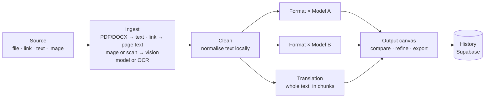
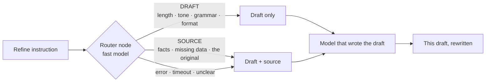
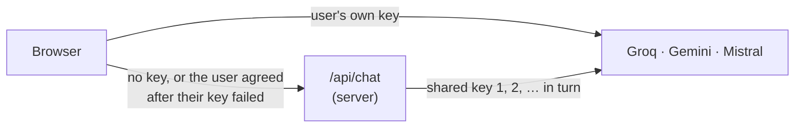
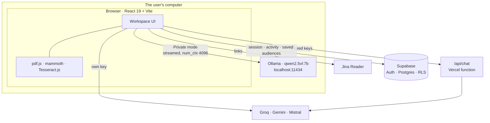

<div align="center">


# Sankshep.ai

**One source in. Every format out.**

A generative AI workspace that turns a single report, article or advisory into executive summaries, social posts, slide decks, video scripts and translations, all drafted in parallel, then refined in plain language. For documents that can't leave the building, **Private mode** does the whole job on your own computer.

*Smart India Hackathon 2026 · Problem statement: Gen AI Platform for Automated Content Transformation*

**Live: [sankshep-ai.vercel.app](https://sankshep-ai.vercel.app)**

[](Sankshep-System-Architecture.pdf)
[](NeuralNinjasVgec-132743.pdf)
[](https://youtu.be/u4sPNRXTmRE)
[](https://sankshep-ai.vercel.app)

[](https://react.dev)
[](https://www.typescriptlang.org)
[](https://vite.dev)
[](https://tailwindcss.com)
[](https://supabase.com)
[](https://vercel.com)

[Project documents](#project-documents) · [What it does](#what-it-does) · [Private mode](#private-mode-ai-that-never-leaves-your-computer) · [Features](#features) · [Quick start](#quick-start) · [How it works](#how-it-works) · [Architecture](#architecture) · [Deploy](#deploy) · [Team](#team)

</div>

---

## Project documents

> [!IMPORTANT]
> **System Architecture document: [Sankshep-System-Architecture.pdf](Sankshep-System-Architecture.pdf)** (2 pages). It shows the full pipeline, from sign-in to History, and the eight architectural layers. Click the link to open it in GitHub's PDF viewer.
>
> **Technical presentation: [NeuralNinjasVgec-132743.pdf](NeuralNinjasVgec-132743.pdf)** (6 slides): idea, technical approach, prototype, feasibility, impact and references.

Submission deliverables for SIH 2026 · Problem statement **SIH26154** (NTRO) · Team **NeuralNinjasVgec**:

| Deliverable | Where to find it |
|---|---|
| Source code | This repository (the app is in [`main/`](main)) |
| README with setup instructions | This file: see [Quick start](#quick-start) |
| **Architecture document** | **[Sankshep-System-Architecture.pdf](Sankshep-System-Architecture.pdf)**; text version in [`architecture_slide.md`](architecture_slide.md) |
| **Technical presentation** (SIH idea submission, 6 slides) | **[NeuralNinjasVgec-132743.pdf](NeuralNinjasVgec-132743.pdf)** |
| Demo video | [youtu.be/u4sPNRXTmRE](https://youtu.be/u4sPNRXTmRE) |
| Live prototype | [sankshep-ai.vercel.app](https://sankshep-ai.vercel.app) (use **Continue with the demo account** on the sign-in page) |

## What it does

Organisations spend hours turning the same source material into briefs, posts, decks and scripts. Sankshep (संक्षेप, Hindi for *"in brief"*) does that step for them:

1. **Bring a source.** Upload a PDF, Word (.docx), TXT, Markdown, CSV or JSON file or an image, paste a link, or paste text.
2. **Choose what you need.** Pick any of 10 formats, or describe your own; set the tone, the audience who will read the result, and the AI model.
3. **Get every draft at once.** Each format is written in parallel. Compare models side by side, ask for changes in plain words, and find it all again in your History.

No API keys are needed to start: sign in (or use the demo account) and press Generate.

## Private mode: AI that never leaves your computer

**Sankshep's flagship privacy feature.** Most AI writing tools can only work by sending your document to someone else's servers. Contracts, financial statements, board papers and anything under NDA can't go there. Private mode moves every step onto the user's own machine: the file is read in the browser, and every draft is written by **Qwen 2.5 VL (`qwen2.5vl:7b`) running locally through [Ollama](https://ollama.com)**. No Sankshep server, no AI provider and no API key is involved.

One switch at the top of the workspace sidebar chooses the mode:

| | **Cloud APIs** (fast) | **Private** (on-device) |
|---|---|---|
| Who writes the drafts | Groq, Mistral or Gemini | Your own GPU, through Ollama at `localhost:11434` |
| Your document's text | Sent to the AI provider | **Stays on your computer** |
| Images and scanned pages | Read by a vision model | **Read by OCR in the browser**, then sent to the model as text |
| Refining a draft | A cloud router picks the context | **Stays local:** no router call, the draft (and the source, when it fits) goes to the same local model |
| Links as a source | Fetched through Jina Reader | **Switched off**, because a link can only be fetched by a cloud service |
| What History saves | A source excerpt and the drafts | **Counts, formats and the model name only,** never the text or file name |
| How drafts arrive | All formats in parallel | **Streamed** onto the canvas as they're written, one format at a time |

**Built for ordinary laptops.** Every request passes `num_ctx: 4096` and `temperature: 0.3` to Ollama. A 4,096-token window keeps a 7B model's memory inside an 8 GB GPU (larger windows can run such cards out of memory), and the draft length is capped so prompt and draft never overflow the window, which would make Ollama silently drop the start of the document. Formats are written one at a time, since parallel requests on one GPU each need their own context memory.

**Stop means stop.** The run's `AbortController` is wired into the stream: pressing **Stop generating** closes the connection, Ollama stops generating at once, and the half-written draft stays on the canvas, frozen where it stopped and marked as *Stopped mid-draft*.

**Setup, guided in the app.** When Private is chosen, the workspace checks `http://localhost:11434/api/tags` and shows either **● Local engine ready · qwen2.5vl:7b** or a setup card that tells apart the three ways it can fail (Ollama not running, Ollama blocking the site, model not installed) and picks out the step that's left. It re-checks on its own every 10 seconds and whenever you return to the tab; Generate stays disabled until the engine is ready.

**Hardware check before setup.** The setup card first reads what the browser shares about the computer (`navigator.deviceMemory`, `navigator.hardwareConcurrency`, and the GPU name from WebGL, or WebGPU's high-performance adapter) and shows it as RAM · CPU · GPU. A dedicated GPU or Apple Silicon, or at least 8 GB of RAM with 6 cores, shows **Hardware verified** and the setup steps. A phone or tablet, under 8 GB of RAM, or integrated graphics with fewer than 6 cores shows **Hardware insufficient for a local 7B model** instead: the steps are held back so nobody downloads a 6 GB model that would freeze their machine, and **Switch to Cloud APIs** is one press away. When the browser doesn't share enough (Firefox and Safari hide memory; Safari hides the GPU), the card says it couldn't verify and shows the steps. Browsers often see only the integrated chip on two-GPU laptops, so a warned user can still choose **Set it up anyway**.

### Set up Private mode

1. Install [Ollama](https://ollama.com/download) and open it.
2. Download the model (about 6 GB, once):
   ```bash
   ollama pull qwen2.5vl:7b
   ```
   Any installed Qwen 2.5 model is detected; if there are several, pick one in the **AI engine** step.
3. **Only for the deployed site** (not needed on `localhost`): let the site reach Ollama, then quit and reopen Ollama.
   ```bash
   # Windows (PowerShell)
   setx OLLAMA_ORIGINS "https://sankshep-ai.vercel.app"
   # macOS
   launchctl setenv OLLAMA_ORIGINS "https://sankshep-ai.vercel.app"
   # Linux (run instead of the service)
   OLLAMA_ORIGINS="https://sankshep-ai.vercel.app" ollama serve
   ```
   Naming the site, rather than `*`, keeps other websites you visit from using your local models.

Private mode works in Chrome, Edge and Firefox. Safari doesn't let secure websites reach apps on the same computer, so it needs one of the others (or the app running on `localhost`). If the browser asks whether the site may reach apps on your device, choose **Allow**.

## Features

### The workspace

**Sidebar + Hero Canvas.** The Transform view is one full-height app window under the navigation. Settings live in a narrow sidebar on the left (source, outputs, voice, audience, engine) that scrolls on its own, with the Generate button pinned to its foot so it is always in reach. The rest of the screen is a clean editorial canvas for the drafts. The sidebar collapses with one click, giving the canvas the full width for distraction-free reading; everything you set is kept while it is hidden. On phones the sidebar stacks above the canvas.

### What it can do

| | |
|---|---|
| **Private mode (on-device AI)** | One switch moves the whole job onto the user's computer: drafts are written by `qwen2.5vl:7b` through a local Ollama, streamed onto the canvas, with nothing sent to Sankshep or any AI provider. See [Private mode](#private-mode-ai-that-never-leaves-your-computer). |
| **Zero-config AI** | Shared Groq, Gemini and Mistral keys live on the server (`/api/chat`), and a model is already chosen, so the first draft is one click away. Anyone can add their own key in the **AI engine** step instead. |
| **One source, many formats** | Executive Summary, LinkedIn Post, Twitter/X thread, Video script and storyboard, Slide deck (exports to PowerPoint), Blog Post, Advisory, Infographic brief, Simplified Explanation, and translation into six Indian languages. Or describe a format in your own words. Every selected format is drafted in parallel from the same source. |
| **Smart generation check (your tokens, respected)** | Tokens cost money on a paid key and run out on a free one, so Sankshep never spends them on a draft you already have. When you press Generate, it compares your selection with the drafts already on the canvas from the same source and settings. If some are there, a prompt says *"Some of these formats have already been generated."* and offers **Generate only new formats** (sends just the new ones; every existing draft stays, edits and refinements included), **Regenerate all**, or **Cancel**. An all-new selection is simply added next to the existing drafts. The new formats show as tabs being written while the others stay readable. |
| **Dynamic context routing for Refine** | Type a change under any draft ("make it shorter", "add the budget figure from the report") and only that draft is rewritten. A fast routing model first decides what the change needs: style, length, tone and formatting edits are sent with **the draft only**, so they stay small and keep the draft's facts as they are; requests for facts, missing detail or anything in the original are sent with **the draft and the source**, so the model can look it up instead of guessing. If routing fails or times out, the source is included, so accuracy never depends on it. |
| **Consent-based key fallback** | If your own key fails (rejected, out of quota, rate-limited beyond a short wait, or the provider keeps erroring), nothing switches behind your back. The run pauses and a prompt shows the provider's exact error and asks: *"Would you like to generate this using Sankshep.ai's free API key instead?"* **Use Sankshep Key** re-runs through the shared keys; **Cancel** leaves the workspace idle and sends nothing else. |
| **Stop mid-generation** | While drafting, Generate becomes **Stop generating** (also in the canvas header, so it works with the sidebar collapsed), and Refine becomes **Stop**. Stopping aborts the requests at once through an `AbortController`; drafts that already finished stay on the canvas, the rest are dropped, and a note says how many were kept. |
| **Every kind of source** | PDF and DOCX are turned into text in the browser. Scanned PDFs (no text layer) have their first 10 pages read like images. Links are fetched and read as the page's text. |
| **Image reading** | Images and scanned pages are read by a Gemini or Mistral vision model, or by **on-device OCR** (Tesseract.js) if no vision model is available. In Private mode they are always read by on-device OCR. |
| **Model comparison** | Run the same brief through up to **3 models** and read the drafts side by side, each with word counts and one-click copy. |
| **Audience targeting** | The audience is who will read, watch or receive the final content (choosing HR/Sales means the drafts are written to be handed to HR and sales staff). Four presets, or describe your own and **save it to your account** for next time. |
| **Full-length translation** | Translation covers the whole source, line by line, in chunks, however long the document is. |
| **History & Analytics** | Every draft is logged with its format, provider, model and word counts. Filter your history by format and see usage at a glance. |
| **Install as an app** | Installable on Android, iPhone, iPad, Mac and Windows from the website itself (a PWA). The landing page shows **Download for Android** or **Download for iOS** on those devices. On phones and tablets, the three-line menu in the top navigation reaches every page. |
| **Accounts & admin** | Email sign-up with no verification step, a shared demo account, self-service account deletion, and an admin panel for all users and activity. The admin can **disable** an account (it keeps its data but is signed out everywhere and can't sign in; anyone trying is told it's disabled and to contact the admin), **enable** it again, or delete it. |

The public [`/features`](https://sankshep-ai.vercel.app/features) page walks through the main features with interactive previews.

## Quick start

**You need:** [Node.js 22](https://nodejs.org) and Git.

```bash
git clone https://github.com/SiddharthDevmurari/SankShep.ai.git
cd SankShep.ai/main
npm install
npm run dev
```

Open <http://localhost:8443>, click **Continue with the demo account** on the sign-in page, and you're in. That's all: no keys or `.env` file to set up.

> **Where the AI keys come from.** The local dev server forwards AI requests to the deployed site's `/api/chat`, which holds the project's shared keys as Vercel environment variables. The keys never appear in this repository. Users can also paste their own key in the **AI engine** step.
>
> **No Supabase setup needed.** Every copy of the app connects to the same central Supabase project, pinned in [`src/lib/supabase.ts`](main/src/lib/supabase.ts). Accounts and activity are shared across all machines.

#### Optional: use your own keys locally

To run AI requests on your machine with your own keys instead of through the deployed site, copy the example file and fill it in:

```bash
cp .env.local.example .env.local      # Windows: copy .env.local.example .env.local
```

```bash
GROQ_API_KEYS=gsk_first_key,gsk_second_key
GEMINI_API_KEYS=your_gemini_key
MISTRAL_API_KEYS=first_key,second_key
```

Get keys from [Groq](https://console.groq.com/keys), [Google AI Studio](https://aistudio.google.com/apikey) and [Mistral](https://console.mistral.ai/api-keys). `.env.local` is git-ignored; never commit keys.

### Environment variables

All optional for local development. Set them in Vercel for the deployed site (see [Deploy](#deploy)). They are read only by the server route [`api/chat.ts`](main/api/chat.ts), never by the browser, so they don't end up in the website's code.

| Variable | Purpose |
|---|---|
| `GROQ_API_KEYS` | Shared Groq keys, comma-separated, tried in turn |
| `GEMINI_API_KEYS` | Shared Gemini keys |
| `MISTRAL_API_KEYS` | Shared Mistral keys |
| `SANKSHEP_API_ORIGIN` | Local dev only: the site whose `/api/chat` to use when there are no local keys (defaults to `https://sankshep-ai.vercel.app`) |

Don't name provider keys with a `VITE_` prefix: Vite builds every `VITE_` variable into the public website.

### Scripts

Run these inside `main/`:

| Command | What it does |
|---|---|
| `npm run dev` | Dev server with hot reload at <http://localhost:8443>, including `/api/chat` |
| `npm run build` | Production build to `main/dist/` |
| `npm run preview` | Serve the production build locally (without `/api/chat`: only users' own keys work) |
| `npm run format` | Format with oxfmt |

### Troubleshooting

| What you see | Fix |
|---|---|
| "System API keys are exhausted" | The deployed site's keys are used up or invalid (update them in Vercel), or, if you use a local `.env.local`, a variable name has a typo. Restart `npm run dev` after editing it. |
| "Your … API key didn't work" prompt | Your own key was rejected, is out of quota, or is rate-limited. Choose **Use Sankshep Key** to continue with the shared keys, or fix the key in the **AI engine** step. |
| "Port 8443 is already in use" | Another copy of the dev server is running. Close it, or run `npx vite --port 5173`. |
| A Mistral model says it isn't available | The Mistral plan behind the key doesn't include that model. Pick `open-mistral-nemo` or another provider. |
| A long document is slow | Free Groq keys allow about 8,000 tokens a minute; the app waits and retries rather than failing. Gemini handles long sources fastest. Press **Stop generating** at any point to keep what has finished. |
| "Ollama isn't running on this device" | Open the Ollama app (or run `ollama serve`); the card turns ready by itself within 10 seconds. |
| "Ollama is running, but it blocks this site" | Set `OLLAMA_ORIGINS` to the site's address as shown in the card, then quit and reopen Ollama. |
| "Your machine ran out of memory loading qwen2.5vl:7b" | Close other apps using the GPU and generate again. Ollama moves part of the model to the CPU when the GPU is short of memory, which works but writes more slowly. |
| The first Private draft takes a while to start | The first run loads the model from disk into memory, which can take a minute; later drafts start at once while it stays loaded. |
| A 400 from `activity_logs` in the browser console | Harmless: the database is missing the optional section 10 columns, so the app retries the insert without them. Run section 10 of `schema.sql` to silence it. |

## Install the app

Sankshep is an installable web app (PWA): no app store, and every deploy updates it automatically.

| Device | How |
|---|---|
| **Android** | Open [sankshep-ai.vercel.app](https://sankshep-ai.vercel.app) in Chrome and tap **Download for Android** on the landing page, then **Install**. (Or browser menu ⋮ → **Install app**.) |
| **iPhone / iPad** | Open the site in Safari, tap **Download for iOS** for the steps: **Share** → **Add to Home Screen** → **Add**. |
| **Mac** | Safari: **File → Add to Dock**. Chrome or Edge: the install icon at the right of the address bar. |
| **Windows** | Chrome or Edge: the install icon at the right of the address bar. |

The install files are `main/public/manifest.webmanifest`, the icons in `main/public/`, and the service worker `main/public/sw.js`. The service worker only caches the site's own files; AI requests and account data always go to the network. It runs in production builds only (`npm run build`), not in `npm run dev`.

## How it works

The pipeline in [`src/lib/pipeline.ts`](main/src/lib/pipeline.ts) follows the LangGraph state-graph pattern: each step is a node, and the (format × model) nodes fan out in parallel. It is plain TypeScript running in the browser, with no LangGraph dependency.


```mermaid
flowchart LR
    A["Source<br/>file · link · text · image"] --> B["Ingest<br/>PDF/DOCX → text · link → page text<br/>image or scan → vision model or OCR"]
    B --> C["Clean<br/>normalise text locally"]
    C --> F1["Format × Model A"]
    C --> F2["Format × Model B"]
    C --> F3["Translation<br/>whole text, in chunks"]
    F1 --> G["Output canvas<br/>compare · refine · export"]
    F2 --> G
    F3 --> G
    G --> H[("History<br/>Supabase")]
```

- **Ingest:** PDF and DOCX are parsed in the browser (pdf.js, mammoth). Scanned PDF pages and images are read by a vision model, falling back to on-device OCR. Links are fetched through [Jina Reader](https://jina.ai/reader), because models can't open links themselves.
- **Clean:** the text is normalised in the browser, so nothing is cut off and no model call is spent on it.
- **Draft in parallel:** every *(format, model)* pair is its own node, run a few at a time per provider so free-tier rate limits hold. A rate-limited request waits and retries; one failed draft never takes down the rest. Tone and audience go into every prompt.
- **Long sources:** each provider has a size budget. If the source is longer, drafts are written from passages spread across the whole document, and the canvas says so. Translation is the exception: it always covers the full text.
- **Review:** drafts land on the canvas; each model's run is logged as its own History entry.

### Refine: dynamic context routing


```mermaid
flowchart LR
    R["Refine instruction"] --> C{"Router node<br/>fast model"}
    C -- "DRAFT<br/>length · tone · grammar · format" --> D["Draft only"]
    C -- "SOURCE<br/>facts · missing data · the original" --> S["Draft + source"]
    C -- "error · timeout · unclear" --> S
    D --> M["Model that wrote the draft"]
    S --> M
    M --> O["This draft, rewritten"]
```

The router (`routeRefinement`) is one short call to a small, fast model on the same provider (`gpt-oss-20b` on Groq, `mistral-small-latest`, `gemini-3.5-flash-lite`) that answers `DRAFT` or `SOURCE`. It gives up after 8 seconds and cancels its own request; anything other than a clear `DRAFT` includes the source.

### Smart generation check

Every Generate is planned before a single request is sent (`handleGenerate` in [`TransformView.tsx`](main/src/workspace/TransformView.tsx)):

| The canvas has… | What happens |
|---|---|
| Nothing, or drafts from a different source, tone, audience, custom instructions or models | A fresh run replaces the canvas |
| Some of the selected formats, from the same brief | The prompt asks: **Generate only new formats** (only those are sent, the rest are kept with their edits), **Regenerate all**, or **Cancel** |
| None of the selected formats, same brief | The new formats are drafted and added next to the existing ones |
| All of the selected formats | They are regenerated, as asked |

A draft that failed counts as missing, so it is written again, and a translation into a different language counts as a new format. Only the new drafts are logged to History for that run. The same principle runs through the rest of the pipeline: draft-only Refine requests don't resend the source, and Stop ends a run the moment you no longer need it.

### Stopping and key failures

Every model request takes an `AbortSignal`. One controller per run is threaded through every node: pressing Stop aborts the in-flight requests and any wait between retries, finished drafts are returned, and unfinished ones are marked as stopped and dropped. Leaving the workspace, or starting a new run while a refine is in flight, cancels it the same way.

A user's own key is never swapped for the shared keys silently. When it fails, `chat()` throws an `OwnKeyError` carrying the provider's own message; the run halts every other node on the same key and the workspace shows the consent prompt. A short per-minute rate limit (the provider asks to wait 15 seconds or less) is waited out quietly, at most twice, and a provider outage gets a few quick retries, before asking. On consent the same run is repeated with that provider's requests going through `/api/chat`; for Refine, the choice holds for the rest of that run's drafts.

### Where API keys are used


```mermaid
flowchart LR
    U["Browser"] -- "user's own key" --> P["Groq · Gemini · Mistral"]
    U -- "no key, or the user agreed<br/>after their key failed" --> S["/api/chat<br/>(server)"]
    S -- "shared key 1, 2, … in turn" --> P
```

A user's own key goes straight from their browser to the provider. Without one (or once they choose Sankshep's key after theirs fails), the request goes to `/api/chat`, which adds a shared key from the environment variables and moves on to the next key if one is rejected or rate-limited.

### What goes where

| | Your browser | Sankshep server (`/api/chat`) | AI provider | Sankshep database |
|---|---|---|---|---|
| **Source text** | Read here first | Passed through, not stored | Sent to write drafts | First 300 characters only |
| **Your API key** | Tab memory only | Never sent there | Sent with each request | **Never stored** |
| **Shared API keys** | **Never sent** | Environment variables | Sent with each request | **Never stored** |
| **Uploaded file or image** | Parsed / OCR'd here | Only a vision request's image | Only with a vision model | **Never stored** |
| **Link** | Sent to Jina Reader to fetch the page | | | Link kept in History |
| **Drafts** | Shown on the canvas | Passed through | Written there | Kept for your History |
| **Saved audience profiles** | Shown in the Audience step | | | Stored on your account |
| **Password** | Typed here | **Never sent** | **Never sent** | Salted hash (Supabase Auth) |

This table is for Cloud mode. In **Private mode** the source, uploaded files and drafts never leave the browser and the local Ollama: nothing goes to the Sankshep server or an AI provider, links can't be used, and History stores only counts, formats and the model name (see [Private mode](#private-mode-ai-that-never-leaves-your-computer)).

The full detail is on the in-app [Privacy Policy](main/src/pages/legal/PrivacyPolicyPage.tsx) page (`/privacy-policy`).

## Architecture

> 📄 The full system architecture, with every pipeline step and layer, is in **[Sankshep-System-Architecture.pdf](Sankshep-System-Architecture.pdf)**.

The React app talks to Supabase (auth and data) directly. AI requests go either straight to the provider (user's key) or through one small server function, [`api/chat.ts`](main/api/chat.ts), which holds the shared keys. In development, Vite serves the same function (see `vite.config.ts`). In Private mode the only AI request is from the browser to the Ollama on the same computer.


```mermaid
flowchart TB
    subgraph Device["The user's computer"]
        subgraph Browser["Browser · React 19 + Vite"]
            UI["Workspace UI"]
            PARSE["pdf.js · mammoth · Tesseract.js"]
        end
        OLLAMA["Ollama · qwen2.5vl:7b<br/>localhost:11434"]
    end
    UI --- PARSE
    UI -- "Private mode<br/>streamed, num_ctx 4096" --> OLLAMA
    UI -- "own key" --> P["Groq · Gemini · Mistral"]
    UI -- "shared keys" --> API["/api/chat<br/>Vercel function"]
    API --> P
    UI -- "links" --> J["Jina Reader"]
    UI -- "session · activity · saved audiences" --> S[("Supabase<br/>Auth · Postgres · RLS")]
```

### Tech stack

| Layer | Tools |
|---|---|
| Interface | React 19, TypeScript 5.7, Vite 8, Tailwind CSS v4, React Router 7, Motion (animations), Lucide icons |
| AI pipeline | LangGraph-style node graph in TypeScript: parallel (format × model) nodes, a refine router node, one `AbortController` per run |
| AI providers | Groq, Google Gemini and Mistral REST APIs; shared keys via a Vercel function |
| On-device AI | Ollama running `qwen2.5vl:7b`, called from the browser with streamed `/api/generate` (NDJSON) |
| Documents | pdf.js (PDF), mammoth (DOCX), Tesseract.js (on-device OCR), pptxgenjs (PowerPoint export) |
| Data & auth | Supabase Auth and Postgres with row-level security |
| Hosting | Vercel: static site plus the `/api/chat` serverless function (`vercel.json` included) |

### Routes

| Route | Page | Access |
|---|---|---|
| `/` | Landing page | Public |
| `/features` | The main features, with interactive previews | Public |
| `/how-it-works` | Animated walkthrough of the pipeline and data flow | Public |
| `/about` | The team and the SIH problem statement | Public |
| `/contact` | GitHub, LinkedIn and email for each team member | Public |
| `/privacy-policy`, `/terms-and-conditions` | Legal pages | Public |
| `/login` | Sign in / sign up | Public |
| `/workspace` | Transform: configure and generate | Signed in |
| `/workspace/history` | Every draft, filterable by format | Signed in |
| `/workspace/analytics` | Totals, format usage, recent drafts | Signed in |
| `/workspace/admin` | All users (disable, enable, delete) and all activity | Admin only |
| `POST /api/chat` | Shared-key AI requests | Server function |

### Security model

- **Every `/workspace` path is behind an auth guard.** Nothing renders until the session check finishes (a neutral loading screen shows meanwhile, for at most 12 seconds on a bad connection); signed-out visitors are sent to `/login` and returned to the page they asked for after signing in.
- **The guard is only the first layer.** The database enforces access on its own: row-level security lets an account read only its own rows (or everyone's, for the admin), insert only as itself, and every admin and deletion function checks permissions on the server.
- **Signing out always clears the session on this device,** even when Supabase can't be reached.
- **Shared API keys stay on the server.** They are environment variables read by `/api/chat`; the website's code contains none.
- **Users' own keys are never persisted,** not to Supabase, logs or browser storage, and are never replaced by the shared keys without the user's say-so.
- **Disabled accounts are locked by Supabase Auth itself.** Disabling sets the account's `banned_until`, so sign-in fails with `user_banned` and its sessions can't be refreshed; the account's existing sessions are deleted at the same moment. An access token issued earlier stays valid for up to an hour, so row-level security also refuses new activity from a disabled account, and an open workspace checks `my_account_disabled()` on focus and every two minutes and signs itself out. Only the admin can disable or enable, never the admin account itself, and all of it is checked in the database (`admin_set_user_disabled`).
- **Private mode keeps documents on the device.** Drafting, refining and image reading all run on the user's computer; the only record that reaches the database is the run's counts, formats and model name. The setup guide recommends allowing only this site in `OLLAMA_ORIGINS`, never `*`.

### Project structure

```
main/
├── api/
│   └── chat.ts                  # Server function: shared keys, rotation, rate-limit handling
├── src/
│   ├── lib/
│   │   ├── pipeline.ts          # Ingest → clean → parallel (format × model) drafts, translation, refine router
│   │   ├── providers.ts         # Model catalogue, chat client, OwnKeyError, abort signals
│   │   ├── local.ts             # Private mode: Ollama detection and streamed generation (num_ctx 4096)
│   │   ├── hardware.ts          # Private mode: can this computer run a 7B model? (RAM, cores, GPU)
│   │   ├── documents.ts         # PDF / DOCX → text; scanned PDF → page images
│   │   ├── ingest.ts            # Image → text: vision model or on-device OCR
│   │   ├── audiences.ts         # Custom audience profiles saved to the account
│   │   ├── activity.ts          # Activity logging and History/Analytics queries
│   │   ├── exporters.ts         # Markdown, text and PowerPoint export
│   │   └── supabase.ts          # Central Supabase client
│   ├── contexts/AuthContext.tsx # Session, sign-in/up, sign-out, account deletion
│   ├── components/
│   │   ├── ProtectedRoute.tsx   # Auth guard for /workspace/*
│   │   └── site/SiteChrome.tsx  # Shared site nav (with the mobile menu) and footer
│   ├── pages/
│   │   ├── LandingPage.tsx
│   │   ├── FeaturesPage.tsx
│   │   ├── HowItWorksPage.tsx
│   │   ├── AboutPage.tsx
│   │   ├── LoginPage.tsx
│   │   ├── WorkspacePage.tsx    # Workspace shell, capsule header and tabs
│   │   └── legal/               # Privacy Policy and Terms
│   ├── workspace/
│   │   ├── TransformView.tsx    # Sidebar + canvas layout; runs, stops and logs each generation
│   │   ├── LeftPanel.tsx        # Settings sidebar: processing mode, source, formats, voice, audience, engine
│   │   ├── LocalEngine.tsx      # Cloud / Private switch, local engine status, hardware check and setup guide
│   │   ├── RightPanel.tsx       # Output canvas: drafts, comparison, refine, export
│   │   ├── KeyConsentDialog.tsx # The "use Sankshep's key instead?" prompt
│   │   ├── DuplicateFormatsDialog.tsx # The "only new formats / regenerate all" prompt
│   │   ├── HistoryView.tsx
│   │   ├── AnalyticsView.tsx
│   │   └── AdminPanel.tsx
│   └── index.css                # Tailwind v4 theme and design tokens
├── supabase/
│   ├── schema.sql               # Tables, RLS, functions, demo account
│   ├── create_admin.sql         # Creates or resets the admin account
│   └── reset_accounts.sql       # DESTRUCTIVE fresh start: deletes every other account and all history, resets admin and demo
├── .env.local.example           # Template for the shared API keys
├── vite.config.ts               # Also serves /api/chat during npm run dev
└── vercel.json                  # Build, /api/chat timeout, SPA rewrites
```

## Database setup

*One-time, for the project owner only. Anyone who just clones and runs the app can skip this.*

1. Open the [Supabase SQL Editor](https://supabase.com/dashboard/project/onhqpaqqwsdnuxwkxksh/sql/new), paste [`main/supabase/schema.sql`](main/supabase/schema.sql), and run it. This creates `profiles` and `activity_logs`, the row-level security policies, the admin and deletion functions, and the shared demo account `demo@gmail.com` / `Demo@1234`. It is safe to run again.
   - Section 10 adds the `models` and `input_words` columns used by History. It's optional: without them the app keeps that data inside the existing `outputs` column.
   - Section 11 adds disabling and enabling accounts from the Admin panel. Databases set up before it need the file run once more; until then the Disable button explains that.
2. Under **Authentication → Sign In / Providers → Email**, turn **Confirm email** off and save. Accounts are created and signed in immediately, and no emails are sent.
3. To create the admin, paste [`main/supabase/create_admin.sql`](main/supabase/create_admin.sql) into the SQL Editor, replace `CHANGE_ME` with a password of 8+ characters, and run it. Re-run it any time to reset the password. `admin@gmail.com` gets the admin role automatically.

Users can delete their own account from the account menu in the workspace; the admin can delete any account from the Admin panel, or disable it instead and enable it again later. The demo and admin accounts can't be deleted, and the admin account can't be disabled. `reset_accounts.sql` re-enables the admin and demo accounts if either was disabled.

## Deploy

1. Sign in at [vercel.com](https://vercel.com/login) with GitHub, then import the repo: <https://vercel.com/new/import?s=https://github.com/SiddharthDevmurari/SankShep.ai>.
2. On **Configure Project**, set **Root Directory** to `main`. The framework is detected as Vite, and `vercel.json` handles the rest.
3. Under **Environment Variables**, add `GROQ_API_KEYS`, `GEMINI_API_KEYS` and `MISTRAL_API_KEYS` (same values as your `.env.local`), then click **Deploy**.
4. From then on, every push to `main` deploys automatically. To change keys later: **Project → Settings → Environment Variables**, then **Deployments → ⋯ → Redeploy**.

Supabase needs no configuration.

## Known limitations

- **The demo account is shared.** Anyone using it can see its History, and it can't save audience profiles. Don't put private material there.
- **Scanned PDFs:** only the first 10 pages are read.
- **Stopping during image reading** takes effect after the current page when on-device OCR is reading it; vision-model reads stop at once.
- **Old Office formats** (`.doc`, `.ppt`, `.xls`) aren't supported. Save them as `.docx` or PDF.
- **Links behind a login** can't be read. Paste the page's text instead.
- **Long sources on Groq** are drafted from passages spread across the document (translation still covers everything). Pick a Gemini model to have the whole source read.
- **Free-tier limits:** long documents on free Groq keys take a few minutes, and some Mistral models aren't included in the free plan.
- **Private mode trades speed and reach for privacy.** Formats are written one at a time, long sources are drafted from passages (about 6,000 characters fit the 4,096-token window), links can't be used, and it needs Ollama on the same computer with a browser other than Safari (or the app on `localhost`). Compare mode isn't available in Private mode.
- **AI drafts can include facts that aren't in the source.** Check them before use.

## Team

**Neural Ninjas VGEC**

Siddharth Devmurari · Vraj Patel · Suhani Jain · Darshil Dhanani · Harshit Vadher · Harsh Thakkar

---

<div align="center">
<sub>Built for Smart India Hackathon 2026 · <a href="main/src/pages/legal/TermsPage.tsx">Terms</a> · <a href="main/src/pages/legal/PrivacyPolicyPage.tsx">Privacy</a></sub>
</div>
