# Sankshep.ai: Technical Approach

The pipeline mostly runs in the browser; the only server-side piece is one small function that holds the shared API keys. Supabase handles accounts and history.

## 1. Pipeline, step by step

| Step | What happens | Where in the code |
|---|---|---|
| **1. Sign in** | Email/password or the demo account through Supabase Auth; every `/workspace` page is behind an auth guard | `AuthContext.tsx`, `ProtectedRoute.tsx` |
| **2. Configure the run** | User picks a source (upload, link or paste), output formats plus custom instructions, tone, audience (4 presets or a profile saved to their account), and the AI engine: 1 model, or up to 3 to compare, with an optional own API key | `LeftPanel.tsx`, `audiences.ts` |
| **3. Read files in the browser** | PDF → text (pdf.js legacy build); DOCX → text (mammoth); TXT/CSV/JSON/MD read directly; scanned PDF → images of the first 10 pages; images scaled down to 2000px | `documents.ts` |
| **4. Ingest node** | Link → page text through Jina Reader; images and scanned pages → a vision model (Gemini 3.5 Flash-Lite / 3.8 Flash, Mistral Medium), falling back to on-device OCR (Tesseract.js) | `pipeline.ts` `ingestNode`, `ingest.ts` |
| **5. Parse node** | Local text cleanup, with no AI call, so nothing is cut off | `pipeline.ts` `parseNode` |
| **6. Fit the source to each model** | Per-provider size budget (Groq 12k, Mistral 60k, Gemini 200k characters); longer sources are sampled evenly across the document | `pipeline.ts` `fitSource` |
| **7. Run the format nodes in parallel** | One node per (format × model), with tone, custom instructions and audience in every prompt; a few at a time per provider (Groq 2, Mistral 2, Gemini 3) | `pipeline.ts` `formatNode`, `withLimit` |
| **7b. Translation node** | Translates the whole source in chunks (2.5k/4k/8k characters) with room for 6,000 output tokens each, halving any chunk that gets cut off | `pipeline.ts` `translateNode` |
| **8. Model gateway** | The user's own key goes straight to the provider; without one (or if it fails) the request goes to `/api/chat`, which rotates the shared keys from environment variables. Waits and retries on rate limits (6 rounds), 2-minute timeout, and tells the user when their key failed | `providers.ts` `chat()`, `api/chat.ts` |
| **9. Output canvas** | Collects every model's drafts; compare side by side, refine a single draft, export to Markdown, text or PowerPoint (.pptx) | `RightPanel.tsx`, `exporters.ts` |
| **10. Log the run** | One record per model in Supabase `activity_logs` (protected by row-level security), including provider, model and word counts | `activity.ts`, `TransformView.tsx` |
| **11. History & Analytics** | Reads those records back: filter by format, provider/model, usage totals | `HistoryView.tsx`, `AnalyticsView.tsx` |

## 2. Architectural layers

| Layer | Steps | Code |
|---|---|---|
| **User Interface** | 1, 2, 9, 11 | React pages: `pages/`, `workspace/` |
| **Client-side Ingestion** | 3, 4 | `documents.ts`, `ingest.ts` |
| **AI Orchestration (pipeline)** | 4, 5, 6, 7, 7b | `pipeline.ts`, a LangGraph-style node graph |
| **Model Gateway / Backend** | 8 | `providers.ts` + Vercel function `api/chat.ts` |
| **AI Inference** | 7, 8 | Groq, Google Gemini, Mistral |
| **State & Storage** | 1, 2, 10, 11 | Supabase Auth and Postgres (row-level security, user metadata) |
| **Delivery** | across all steps | Vercel hosting and installable app (PWA: manifest + service worker) |

## 3. Mermaid diagram (graph LR)

```mermaid
graph LR
  %% ── User Interface ──
  subgraph UI["User Interface · React 19 + Vite 8 + Tailwind 4"]
    A1["Step 1: Sign in<br/><small>Supabase Auth · ProtectedRoute</small>"]
    A2["Step 2: Configure run<br/><small>Source · Formats + instructions · Tone<br/>Audience (presets / saved profiles)<br/>Engine: 1 model or compare up to 3</small>"]
  end

  %% ── Client-side ingestion ──
  subgraph ING["Client-side Ingestion · in the browser"]
    B1["Step 3: File readers<br/><small>PDF → pdf.js (legacy)<br/>DOCX → mammoth<br/>TXT / CSV / JSON / MD</small>"]
    B2["Scanned PDF / image<br/><small>pages rendered to JPEG<br/>downscaled ≤ 2000px</small>"]
    B3["Link<br/><small>Jina Reader → page text</small>"]
    B4["Vision read<br/><small>Gemini 3.5 Flash-Lite / Mistral Medium</small>"]
    B5["OCR fallback<br/><small>Tesseract.js on-device</small>"]
  end

  %% ── Orchestration ──
  subgraph ORCH["AI Orchestration · pipeline.ts (LangGraph-style)"]
    C1["Step 4: Ingest node<br/><small>merge text + link + images</small>"]
    C2["Step 5: Parse node<br/><small>local cleanup, no AI call</small>"]
    C3["Step 6: Fit source<br/><small>budget per provider<br/>Groq 12k · Mistral 60k · Gemini 200k chars</small>"]
    C4["Step 7: Format nodes<br/><small>format × model in parallel<br/>tone + instructions + audience<br/>limit per provider: Groq 2 · Mistral 2 · Gemini 3</small>"]
    C5["Step 7b: Translation node<br/><small>whole text in chunks<br/>halve on truncation</small>"]
  end

  %% ── Gateway ──
  subgraph GW["Model Gateway · providers.ts + Vercel Function"]
    D1{"Own API key?"}
    D2["Direct call<br/><small>user key · browser → provider</small>"]
    D3["/api/chat<br/><small>Vercel Function · shared keys in env<br/>rotation + dead-key tracking</small>"]
    D4["Retry and fallback<br/><small>429 / 5xx waits · 6 rounds · 120s timeout<br/>own-key-failed notice</small>"]
  end

  %% ── Inference ──
  subgraph INF["AI Inference"]
    E1["Groq<br/><small>gpt-oss-120b · gpt-oss-20b · qwen3.8-27b</small>"]
    E2["Google Gemini<br/><small>3.5 Flash-Lite · 3.8 Flash</small>"]
    E3["Mistral<br/><small>Nemo · Codestral · Large / Medium / Small</small>"]
  end

  %% ── Output ──
  subgraph OUT["Output · RightPanel.tsx"]
    F1["Step 9: Output canvas<br/><small>compare models · refine one draft</small>"]
    F2["Export<br/><small>Markdown · Text · PowerPoint (pptxgenjs)</small>"]
  end

  %% ── Storage ──
  subgraph DB["State & Storage · Supabase"]
    G1["Step 10: activity_logs<br/><small>Postgres + row-level security<br/>provider · model · word counts</small>"]
    G2["User metadata<br/><small>saved audience profiles</small>"]
    G3["Step 11: History & Analytics"]
  end

  A1 --> A2
  A2 --> B1 & B3
  A2 -. saved profiles .-> G2
  B1 -- scanned --> B2
  B2 --> B4
  B4 -. fails .-> B5
  B1 --> C1
  B3 --> C1
  B4 --> C1
  B5 --> C1
  C1 --> C2 --> C3 --> C4
  C2 --> C5
  C4 --> D1
  C5 --> D1
  D1 -- yes --> D2
  D1 -- no --> D3
  D2 -. fails .-> D3
  D2 --> E1 & E2 & E3
  D3 --> E1 & E2 & E3
  D3 --- D4
  E1 & E2 & E3 --> F1
  F1 --> F2
  F1 --> G1 --> G3
```

## 4. Tech stack

**Frontend**
- React 19 · TypeScript 5.7 · Vite 8
- Tailwind CSS v4 · React Router 7
- Motion (animations) · Lucide icons

**Document Processing (in the browser)**
- pdf.js (`pdfjs-dist` 6, legacy build): PDF text and scanned-page images
- mammoth: DOCX to text
- Tesseract.js 6: on-device OCR
- pptxgenjs 4: PowerPoint export

**Backend / API**
- Vercel Functions (Node.js), `/api/chat`: shared-key gateway with key rotation
- Jina Reader: fetches the text of links

**Database & Auth**
- Supabase: Auth (email/password) and Postgres with row-level security
- Tables: `profiles`, `activity_logs`; saved audience profiles in user metadata

**AI Inference**
- Groq: gpt-oss-120b (default), gpt-oss-20b, gpt-oss-safeguard-20b, qwen3.8-27b
- Google Gemini: 3.5 Flash-Lite, 3.8 Flash (also used to read images)
- Mistral: Nemo, Codestral, Large, Medium, Small

**Orchestration**
- Custom LangGraph-style pipeline in TypeScript (`pipeline.ts`): ingest, parse, parallel (format × model) nodes, chunked translation node
- Per-provider concurrency limits, rate-limit retries, fallback from the user's key to shared keys

**Hosting & Delivery**
- Vercel: static site and serverless function
- PWA (installable app): web app manifest + service worker

**Tooling**
- Node.js 22 · npm · oxfmt (code formatter)

## Notes

- **`groq-sdk` isn't used.** It's listed in `package.json`, but no code imports it; all providers are called through their REST APIs. Leave it off the slide, or remove it from `package.json`.
- **No LangGraph library is used.** The pipeline is custom code shaped like LangGraph (nodes and parallel branches). Call it "LangGraph-style" rather than listing LangGraph as a dependency, which is how the code itself describes it.
