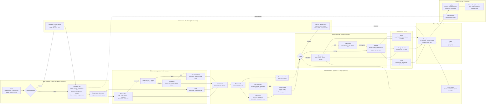

# Sankshep.ai: Technical Approach

The pipeline runs in the browser. One gateway then sends each AI request to one of two places, chosen by the user:

- **Cloud APIs (fast):** Groq, Gemini or Mistral, with the user's own key or through one small server function that holds the shared keys.
- **Private (on-device):** a model running on the user's own computer through Ollama. The document never leaves the machine.

Supabase handles accounts and history, protected by row-level security. The only server code is the shared-key function.

## 1. Pipeline, step by step

| Step | What happens | Where in the code |
|---|---|---|
| **1. Sign in** | Email/password or the demo account through Supabase Auth; every `/workspace` page is behind an auth guard. An account the admin has disabled is refused at sign-in and told to contact the admin | `AuthContext.tsx`, `ProtectedRoute.tsx`, `LoginPage.tsx` |
| **2. Choose the processing mode** | A switch at the top of the sidebar: **Cloud APIs** or **Private**. In Private mode the app checks the local Ollama (`localhost:11434`) and this computer's hardware, and shows a setup guide until both are ready | `LocalEngine.tsx`, `local.ts`, `hardware.ts` |
| **3. Configure the run** | Source (upload, link or paste), output formats plus custom instructions, tone, audience (4 presets or a profile saved to the account), and in Cloud mode the AI engine: 1 model, or up to 3 to compare, with an optional own API key | `LeftPanel.tsx`, `audiences.ts` |
| **4. Plan the run** | The smart generation check compares the request with the drafts already on the canvas: only new formats are sent, or the user chooses to regenerate all | `TransformView.tsx` `handleGenerate`, `DuplicateFormatsDialog.tsx` |
| **5. Read files in the browser** | PDF → text (pdf.js legacy build); DOCX → text (mammoth); TXT/CSV/JSON/MD read directly; scanned PDF → images of the first 10 pages; uploaded images scaled down to 2000px | `documents.ts` |
| **6. Ingest node** | Link → page text through Jina Reader (Cloud mode only); images and scanned pages → a vision model (Gemini 3.5 Flash-Lite / 3.8 Flash, Mistral Medium), falling back to on-device OCR (Tesseract.js). Private mode always uses OCR, so images stay on the device | `pipeline.ts` `ingestNode`, `ingest.ts` |
| **7. Parse node** | Local text cleanup, with no AI call, so nothing is cut off | `pipeline.ts` `parseNode` |
| **8. Fit the source to each model** | Per-engine size budget (Groq 12k, Mistral 60k, Gemini 200k, on-device 6k characters); longer sources are sampled evenly across the document | `pipeline.ts` `fitSource` |
| **9. Run the format nodes** | One node per (format × model), with tone, custom instructions and audience in every prompt. Cloud: a few at a time per provider (Groq 2, Mistral 2, Gemini 3). Private: one at a time, each draft streamed onto the canvas as it is written | `pipeline.ts` `formatNode`, `withLimit` |
| **9b. Translation node** | Translates the whole source in chunks (Groq 2.5k, Mistral 4k, Gemini 8k, on-device 1.2k characters), halving any chunk that gets cut off | `pipeline.ts` `translateNode` |
| **10. Model gateway** | Routes every call. **Own key** → straight to the provider. **No key** → `/api/chat`, which rotates the shared keys from environment variables. **Private** → Ollama, streamed, with `num_ctx: 4096` and `temperature: 0.3`. Waits and retries on rate limits (6 rounds), 2-minute timeout. If the user's own key fails, the run pauses and asks before the shared keys are used | `providers.ts` `chat()`, `api/chat.ts`, `local.ts` `localGenerate` |
| **11. Output canvas** | Collects every model's drafts; compare side by side, export to Markdown, text or PowerPoint (.pptx). **Stop** cancels the run at once through one `AbortController`: finished drafts stay, and a streamed draft is kept as far as it got | `RightPanel.tsx`, `exporters.ts` |
| **12. Refine one draft** | The user types a change under a draft. In Cloud mode a fast router model decides whether the edit needs only the draft (`DRAFT`) or the source too (`SOURCE`); on-device the router is skipped and the rewrite streams in | `pipeline.ts` `routeRefinement`, `regenerateFormat` |
| **13. Log the run** | One record per model in Supabase `activity_logs` (row-level security), with provider, model and word counts. Private runs record counts, formats and model name only, never the text or file name | `activity.ts` `withoutContent`, `TransformView.tsx` |
| **14. History, Analytics & Admin** | Reads those records back: filter by format, provider/model, usage totals. The admin sees every user and all activity, and can disable, enable or delete accounts | `HistoryView.tsx`, `AnalyticsView.tsx`, `AdminPanel.tsx` |

## 2. Two processing modes

| | **Cloud APIs** (fast) | **Private** (on-device) |
|---|---|---|
| Who writes the drafts | Groq, Gemini or Mistral (11 models) | `qwen2.5vl:7b` through Ollama at `localhost:11434` |
| Your document's text | Sent to the AI provider | **Never leaves the computer** |
| Images and scanned pages | Vision model | On-device OCR, then sent to the model as text |
| Links as a source | Jina Reader | Switched off (a link can only be fetched by a cloud service) |
| How drafts arrive | All formats in parallel | Streamed, one format at a time |
| What History keeps | A source excerpt and the drafts | Counts, formats and model name only |
| Setup | None: shared keys are ready | Install Ollama, pull the model; the app checks the hardware and guides each step |

**Built for ordinary laptops.** Each on-device request is held to a 4,096-token window, so a 7B model fits in 8 GB of GPU memory, and the draft length is capped so the prompt is never silently cut off. Before setup, the app reads the RAM, CPU cores and GPU the browser reports and warns when the computer can't run the model, offering Cloud APIs instead.

## 3. Architectural layers

| Layer | Steps | Code |
|---|---|---|
| **User Interface** | 1, 2, 3, 11, 12, 14 | React pages: `pages/`, `workspace/` |
| **Client-side Ingestion** | 5, 6 | `documents.ts`, `ingest.ts` |
| **AI Orchestration (pipeline)** | 4, 6, 7, 8, 9, 9b, 12 | `pipeline.ts`, a LangGraph-style node graph |
| **Model Gateway / Backend** | 10 | `providers.ts` + Vercel function `api/chat.ts` |
| **AI Inference (cloud)** | 9, 10 | Groq, Google Gemini, Mistral |
| **AI Inference (on-device)** | 2, 9, 10 | Ollama with `qwen2.5vl:7b` (`local.ts`, `hardware.ts`) |
| **State & Storage** | 1, 13, 14 | Supabase Auth and Postgres (row-level security, server-checked admin functions, user metadata) |
| **Delivery** | across all steps | Vercel hosting and installable app (PWA: manifest + service worker) |

## 4. Mermaid diagram (graph LR)

```mermaid
graph LR
  %% ── User Interface ──
  subgraph UI["User Interface · React 19 + Vite 8 + Tailwind 4"]
    A1["Sign in<br/><small>Supabase Auth · ProtectedRoute<br/>disabled accounts refused</small>"]
    A0{"Processing mode"}
    A2["Configure run<br/><small>Source · Formats + instructions · Tone<br/>Audience (presets / saved profiles)<br/>Cloud: 1 model or compare up to 3</small>"]
    A3["Smart generation check<br/><small>only formats not on the canvas</small>"]
  end

  %% ── Client-side ingestion ──
  subgraph ING["Client-side Ingestion · in the browser"]
    B1["File readers<br/><small>PDF → pdf.js · DOCX → mammoth<br/>TXT / CSV / JSON / MD</small>"]
    B2["Scanned PDF / image<br/><small>pages rendered to JPEG</small>"]
    B3["Link<br/><small>Jina Reader · Cloud mode only</small>"]
    B4["Vision read<br/><small>Gemini 3.5 Flash-Lite / Mistral Medium</small>"]
    B5["On-device OCR<br/><small>Tesseract.js · always in Private mode</small>"]
  end

  %% ── Orchestration ──
  subgraph ORCH["AI Orchestration · pipeline.ts (LangGraph-style)"]
    C1["Ingest node<br/><small>merge text + link + images</small>"]
    C2["Parse node<br/><small>local cleanup, no AI call</small>"]
    C3["Fit source<br/><small>Groq 12k · Mistral 60k<br/>Gemini 200k · on-device 6k chars</small>"]
    C4["Format nodes<br/><small>format × model<br/>cloud: parallel · on-device: one at a time</small>"]
    C5["Translation node<br/><small>whole text in chunks</small>"]
    C6["Refine router<br/><small>DRAFT or SOURCE · skipped on-device</small>"]
    C7["Run controller<br/><small>one AbortController · Stop keeps finished drafts</small>"]
  end

  %% ── Gateway ──
  subgraph GW["Model Gateway · providers.ts chat()"]
    D0{"Route"}
    D2["Direct call<br/><small>user's own key · browser → provider</small>"]
    D3["/api/chat<br/><small>Vercel Function · shared keys in env<br/>rotation · rate-limit retries</small>"]
    D4["Key consent<br/><small>own key failed → ask the user first</small>"]
  end

  %% ── Inference ──
  subgraph INF["AI Inference · Cloud"]
    E1["Groq<br/><small>gpt-oss-120b · gpt-oss-20b · qwen3.8-27b</small>"]
    E2["Google Gemini<br/><small>3.5 Flash-Lite · 3.8 Flash</small>"]
    E3["Mistral<br/><small>Large / Medium / Small · Nemo · Codestral</small>"]
  end

  subgraph LOCAL["AI Inference · On-device (Private mode)"]
    L1["Hardware check + setup guide<br/><small>RAM · CPU cores · GPU</small>"]
    L2["Ollama · qwen2.5vl:7b<br/><small>localhost:11434 · streamed<br/>num_ctx 4096 · temperature 0.3</small>"]
  end

  %% ── Output ──
  subgraph OUT["Output · RightPanel.tsx"]
    F1["Output canvas<br/><small>live streaming · compare models<br/>refine one draft · Stop</small>"]
    F2["Export<br/><small>Markdown · Text · PowerPoint (pptxgenjs)</small>"]
  end

  %% ── Storage ──
  subgraph DB["State & Storage · Supabase"]
    G1["activity_logs<br/><small>Postgres + row-level security<br/>Private runs: counts only</small>"]
    G2["User metadata<br/><small>saved audience profiles</small>"]
    G3["History · Analytics · Admin<br/><small>admin disables / enables / deletes accounts</small>"]
  end

  A1 --> A0
  A0 -- Cloud --> A2
  A0 -- Private --> L1
  L1 --> A2
  A2 --> A3
  A2 -. saved profiles .-> G2
  A3 --> B1 & B3
  B1 -- scanned --> B2
  B2 -- Cloud --> B4
  B2 -- Private --> B5
  B4 -. fails .-> B5
  B1 & B3 & B4 & B5 --> C1
  C1 --> C2 --> C3 --> C4
  C2 --> C5
  C4 & C5 & C6 --> D0
  C7 -. stop .-> C4
  D0 -- own key --> D2
  D0 -- no key --> D3
  D0 -- Private --> L2
  D2 -. fails .-> D4
  D4 -. user agrees .-> D3
  D2 --> E1 & E2 & E3
  D3 --> E1 & E2 & E3
  E1 & E2 & E3 --> F1
  L2 -- streamed --> F1
  F1 --> C6
  F1 --> F2
  F1 --> G1 --> G3
```

## 5. Security and accounts

- **Shared API keys stay on the server.** They are environment variables read only by `/api/chat`; the website's code contains none. A user's own key lives in the tab's memory and goes only to that provider.
- **Nothing switches silently.** A failing own key pauses the run and shows the provider's exact error; the shared keys are used only if the user agrees.
- **Row-level security on every table.** Each account reads only its own rows; the admin reads all. Every admin action is a server-checked database function, not a UI check.
- **Disable and enable accounts.** The admin can disable an account instead of deleting it. It is locked by Supabase Auth itself (`banned_until`): sign-in is refused, every session is ended at once, an open workspace signs itself out within minutes, and row-level security refuses new activity. The data is kept, and the admin can enable the account again. The admin account can't be disabled.
- **Private mode keeps documents on the device.** Drafting, refining and image reading all run on the user's computer; the only record that reaches the database is the run's counts, formats and model name. The setup guide recommends allowing only this site in `OLLAMA_ORIGINS`, never `*`.
- **Stop means stop.** One `AbortController` per run cancels every in-flight request and any wait between retries.

## 6. Tech stack

**Frontend**
- React 19 · TypeScript 5.7 · Vite 8
- Tailwind CSS v4 · React Router 7
- Motion (animations) · Lucide icons

**Document Processing (in the browser)**
- pdf.js (`pdfjs-dist` 6, legacy build): PDF text and scanned-page images
- mammoth: DOCX to text
- Tesseract.js 6: on-device OCR
- pptxgenjs 4: PowerPoint export

**Backend / API**
- Vercel Functions (Node.js), `/api/chat`: shared-key gateway with key rotation
- Jina Reader: fetches the text of links (Cloud mode)

**Database & Auth**
- Supabase: Auth (email/password, account bans for disabled users) and Postgres with row-level security
- Tables: `profiles` (with `disabled_at`), `activity_logs`; saved audience profiles in user metadata
- Server-checked functions: `admin_list_users`, `admin_set_user_disabled`, `admin_delete_user`, `delete_my_account`, `my_account_disabled`

**AI Inference: Cloud**
- Groq: gpt-oss-120b (default), gpt-oss-20b, gpt-oss-safeguard-20b, qwen3.8-27b
- Google Gemini: 3.5 Flash-Lite, 3.8 Flash (also used to read images)
- Mistral: Large, Medium, Small, Nemo, Codestral

**AI Inference: On-device (Private mode)**
- Ollama with `qwen2.5vl:7b` at `localhost:11434`, called from the browser with streamed `/api/generate` (NDJSON)
- `num_ctx: 4096`, `temperature: 0.3`: sized for an 8 GB laptop GPU
- Hardware check from browser APIs: `navigator.deviceMemory`, `navigator.hardwareConcurrency`, WebGL / WebGPU GPU name

**Orchestration**
- Custom LangGraph-style pipeline in TypeScript (`pipeline.ts`): ingest, parse, fit-source, parallel (format × model) nodes, chunked translation node, refine router
- Per-engine concurrency limits, rate-limit retries, consent before switching from the user's key to shared keys, one `AbortController` per run

**Hosting & Delivery**
- Vercel: static site and serverless function
- PWA (installable app): web app manifest + service worker

**Tooling**
- Node.js 22 · npm · oxfmt (code formatter)

## Notes

- **`groq-sdk` isn't used.** It's listed in `package.json`, but no code imports it; all providers are called through their REST APIs. Leave it off the slide, or remove it from `package.json`.
- **No LangGraph library is used.** The pipeline is custom code shaped like LangGraph (nodes and parallel branches). Call it "LangGraph-style" rather than listing LangGraph as a dependency, which is how the code itself describes it.
- **Ollama isn't bundled.** Private mode needs Ollama installed on the user's computer with `qwen2.5vl:7b` pulled; the app detects it and guides the setup, but can't install it.
